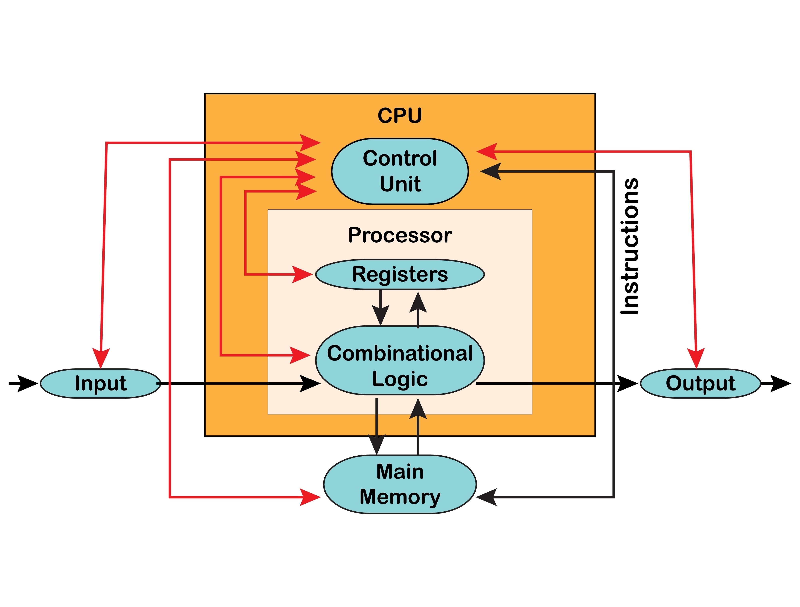

# Modified Mano Basic Computer (VHDL)

**Course:** Computer Architecture
**Instructor:** Dr. Shariatmadar Mortazavi
**Institution:** Amirkabir University of Technology
**Semester:** 1401-1402 (Second Semester)

> **Note:** For complete project requirements, grading criteria, and specific algorithm details, please refer to the `Project discription.pdf` file included in this repository.

> **Note:** For complete project discription read `Report of computer architecture project.pdf`, readme is but a summery

## 📖 Project Overview
This repository contains the VHDL implementation of "Project 1: Basic Computer". This design is a modified version of the standard M. Morris Mano Basic Computer. Unlike the standard Von Neumann architecture, this implementation utilizes a modified architecture with separate memory units for instructions and data to simplify the design process.

### Key Features
* **Split Memory Architecture:**
    * **ROM:** Stores program instructions (Read-Only).
    * **RAM:** Stores data variables (Read/Write).
* **4-State Control Logic:** Implements a Finite State Machine (FSM) synchronized by a system clock.
* **Custom ALU Modules:** Integrates custom hardware for Multiplication and Square Root operations.

---

## ⚙️ System Architecture

### 1. Block Diagram
The system follows a bus-oriented architecture connecting the Memory Units (RAM/ROM), the Register Set, and the ALU.

*Note: While the standard diagram above shows a single Memory unit, this project physically splits it into RAM and ROM components.*

### 2. Memory Organization  
* **Instruction Word:** 16 bits total.
    * **Opcode:** 6 bits (Bits 15-10).
    * **Address:** 10 bits (Bits 9-0).
* **RAM Size:** Although the address bus supports 10 bits (1024 locations), the physical implementation utilizes a 64 x 16 block. Address inputs are padded with zeros to maintain structural integrity.

### 3. Registers
The design includes the following essential registers:
* **AC (Accumulator):** 16-bit main processor register.
* **E (Extension):** 1-bit register to store Carry/Overflow.
* **PC (Program Counter):** Holds the address of the next instruction in ROM.
* **DR (Data Register):** Stores the operand read from RAM.

### 4. Finite State Machine (FSM)
The Control Unit operates on a 4-state cycle synchronized by the clock:

1.  **Fetch:** Reads the instruction from ROM based on the PC value.
2.  **Decode:** Decodes the Opcode to determine the operation.
3.  **Read Operand:** If the instruction requires memory access, data is read from RAM into the DR.
4.  **Execute:** The ALU performs the operation (Logic, Arithmetic, Shift).

---

## 📝 Instruction Set Architecture (ISA)

The computer supports 16 specific instructions.

| Instruction | Opcode (Binary) | Address Req? | Description |
| :--- | :--- | :--- | :--- |
| **AND** | `000001` | Yes | AC ← AC ∧ RAM[Addr] |
| **STORE** | `000010` | Yes | RAM[Addr] ← AC |
| **LOAD** | `000011` | Yes | AC ← RAM[Addr] |
| **ADD** | `000100` | Yes | AC ← AC + RAM[Addr], E ← Carry |
| **INC** | `000101` | No | AC ← AC + 1 |
| **CLA** | `000110` | No | AC ← 0 |
| **CLE** | `000111` | No | E ← 0 |
| **CIR L** | `001000` | No | Circular Left Shift (AC & E) |
| **CIR R** | `001001` | No | Circular Right Shift (AC & E) |
| **SPA** | `001010` | No | Skip if AC is Positive |
| **SNA** | `001011` | No | Skip if AC is Negative |
| **SZE** | `001100` | No | Skip if E is Zero |
| **SZA** | `001101` | No | Skip if AC is Zero |
| **SHL** | `001110` | No | Linear Left Shift |
| **SHR** | `001111` | No | Linear Right Shift |
| **MUL** | `010000` | Yes | Multiply (Custom Module) |
| **SQR** | `100000` | Yes | Square Root (Custom Module) |

### Custom Instructions Details
* **Multiply:** Uses a 6-bit × 6-bit multiplier. The 12-bit output is zero-padded to 16 bits and stored in the AC.
* **SQR:** Uses a 16-bit input square root module. The 8-bit output is zero-padded to 16 bits.

---

## 📂 File Structure
* `RAM.vhd` - Data memory implementation (Read/Write).
* `ROM.vhd` - Instruction memory (Read-Only, pre-loaded with instructions).
* `ALU.vhd` - Arithmetic Logic Unit (Contains logic for AND, ADD, Shifts, MUL, SQR).
* `ControlUnit.vhd` - FSM implementation (Fetch, Decode, Read, Execute).
* `Computer.vhd` - Top-level entity connecting the bus, memory, and CPU.
* `Multiplier.vhd` - 6-bit multiplier component.
* `Sqrt.vhd` - 16-bit square root component.

## 🚀 Usage & Simulation
*(Note: No Testbench is required for final submission as RAM/ROM are modified directly to test sequences.)*

1.  **Load Instructions:** Manually modify the array content in `ROM.vhd` with your binary opcodes.
2.  **Simulation:** Open the project in your VHDL simulator (e.g., ModelSim, Vivado, ISE).
3.  **Observation:**
    * Run the simulation for the required clock cycles.
    * Observe the **AC** signal to see calculation results.
    * Observe the **State** signal to verify the 4-step transition cycle.

## 👥 Contributors
* Erfan Ghasry
* Ali Asadi

---
*Project completed in accordance with the requirements set for Project 1.*